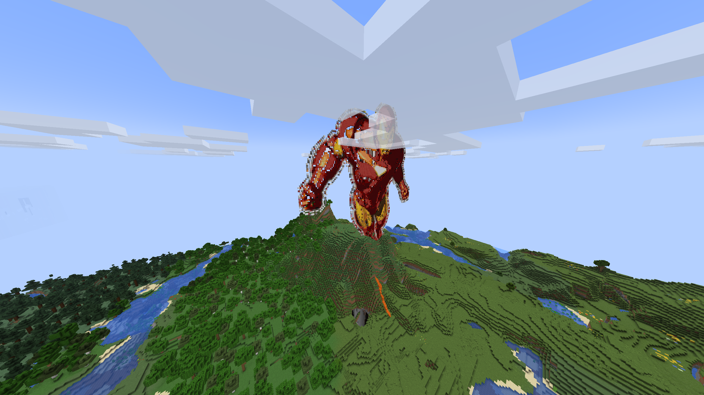

# mkmcfunction.py

## Purpose

This script `mkmcfunction.py` is used to convert an image (JPG/PNG for example) into an `mcfunction` that you can use to render the image in your Minecraft world.

## Usage

Create a datapack. In your minecraft world folder create the directory `datapacks/your_data_pack_name/data/io/functions`.

In the directory `your_data_pack_name` create a file `pack.mcmeta` with these contents,

```json
{
  "pack": {
    "pack_format": 3,
    "description": "Custom datapack"
  }
}
```

Now clone this repository and run the `mkmcfunction.py` script on an image file. It can be a `.jpg` or `.png` file, and probably many others. Transparent (alpha channel) pixels will be replaced with `minecraft:air`. After running this script, it will output an `mcfunction` file with the same base name as the image. Copy this `mcfunction` file into your datapaack functions folder.

To configure the script open it and scroll down to the bottom where we check for `args.image`. Update these variables.

```py
# If you have an image that is 5000x1000, this will scale the image so that neither the width
# nor the height is greater than 100. The result here would be 100x20.
max_dimension = 100
# This is the minimum height any block will be placed.
min_z = 100
# If you want to look down from the sky and see your photo printed on the ground, set this to True
# If you want your print to stand like a cardboard cutout, set this to False
is_horizontal = False
```

Then render a `.mcfunction` file. I usually just put `mkmcfunction.py` in my datapack `functions` folder and omit the `cp` command.

```sh
python3 mkmcfunction.py <image.png>
cp image.mcfunction path/to/world/datapacks/your_data_pack_name/data/io/functions/
```

In Minecraft open a terminal and run `reload`. You can also do this from your server command line.

Since we processed `image.png` and created `image.mcfunction` we can run that function in a Minecraft terminal,

```sh
/function io:image
```

Below is a sample screenshot. There's still a lot of work to do.


